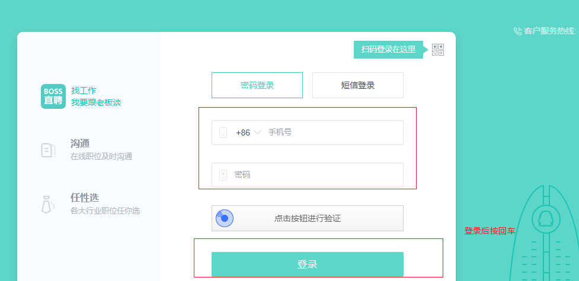
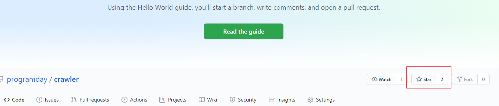

### ==写在前面==

用了4，5天写的，招聘网站上的数据越少，最后数据清洗后，参考价值越小，所以爬取下来的数据有参考价值但是不能全信，一定要结合着招聘网站上的原始搜索数据来做决定，这里只是提供了一种便利查看数据的一些方式

==BOOS第一次要登录自己的账号后，按回车才可以继续爬(需要cookie)==

之后就不用了

### 最终实现

爬取平台：

- BOOS
- 智联
- 51job
- 拉钩

可定制爬取的参数 

1. 城市
2. 职位(==职位越模糊，数据越多==)
3. 工作年限(==实习，1-3年工作经验)

最终将数据清洗完毕后，存入csv文件中

### 目录结构

在cmd或pycharm提供的Terminal中执行：==pip install -r requirements.txt== 安装第三方包，一定要在存在requirement.txt的目录中才可以执行

安装好依赖环境后，点击findejob，按照提示输入内容就可以爬取数据了

ps:智联与51job需要二级爬取，效率太低了，后期考虑加多线程

### 最后

技术不高，所以BUG还有很多，碰到致命BUG了直接私聊我就行，如果有解决方案就最好了😄

有好点子一定要跟我说一声啊，我想抛砖引玉来着

感觉不错的话，给github点个start就最好了

https://github.com/programday/crawler

